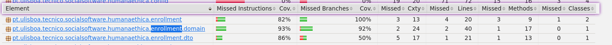
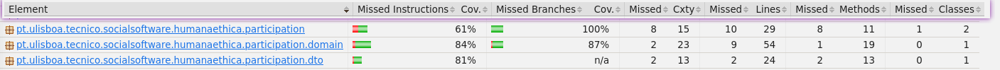
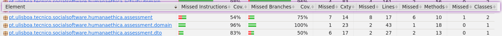

# ES P1 submission, Group 13

## Feature Activity Enrollment

### Subgroup

- Pedro Ribeiro, ist1102663, [GitLab link](https://gitlab.rnl.tecnico.ulisboa.pt/ist1102663)

  - Issues assigned: [#4](https://gitlab.rnl.tecnico.ulisboa.pt/es/es24-13/-/issues/4), [#74](https://gitlab.rnl.tecnico.ulisboa.pt/es/es24-13/-/issues/74), [#75](https://gitlab.rnl.tecnico.ulisboa.pt/es/es24-13/-/issues/75), [#33](https://gitlab.rnl.tecnico.ulisboa.pt/es/es24-13/-/issues/33), [#120](https://gitlab.rnl.tecnico.ulisboa.pt/es/es24-13/-/issues/120), [#](https://gitlab.rnl.tecnico.ulisboa.pt/es/es24-13/-/issues/5), [#30](https://gitlab.rnl.tecnico.ulisboa.pt/es/es24-13/-/issues/30), [#73](https://gitlab.rnl.tecnico.ulisboa.pt/es/es24-13/-/issues/73), [#115](https://gitlab.rnl.tecnico.ulisboa.pt/es/es24-13/-/issues/115), [#121](https://gitlab.rnl.tecnico.ulisboa.pt/es/es24-13/-/issues/121)

- Diogo Rodrigues, ist1102848, [GitLab link](https://gitlab.rnl.tecnico.ulisboa.pt/ist1102848)

  - Issues assigned: [#4](https://gitlab.rnl.tecnico.ulisboa.pt/es/es24-13/-/issues/4), [#5](https://gitlab.rnl.tecnico.ulisboa.pt/es/es24-13/-/issues/5), [#30](https://gitlab.rnl.tecnico.ulisboa.pt/es/es24-13/-/issues/30), [#33](https://gitlab.rnl.tecnico.ulisboa.pt/es/es24-13/-/issues/33), [#72](https://gitlab.rnl.tecnico.ulisboa.pt/es/es24-13/-/issues/4), [#74](https://gitlab.rnl.tecnico.ulisboa.pt/es/es24-13/-/issues/74), [#75](https://gitlab.rnl.tecnico.ulisboa.pt/es/es24-13/-/issues/75), [#116](https://gitlab.rnl.tecnico.ulisboa.pt/es/es24-13/-/issues/116), [#120](https://gitlab.rnl.tecnico.ulisboa.pt/es/es24-13/-/issues/120), [#121](https://gitlab.rnl.tecnico.ulisboa.pt/es/es24-13/-/issues/121)

- Érik Bianchi, ist1103580, [GitLab link](https://gitlab.rnl.tecnico.ulisboa.pt/ist1103580)

  - Issues assigned: [#4](https://gitlab.rnl.tecnico.ulisboa.pt/es/es24-13/-/issues/4), [#71](https://gitlab.rnl.tecnico.ulisboa.pt/es/es24-13/-/issues/71), [#75](https://gitlab.rnl.tecnico.ulisboa.pt/es/es24-13/-/issues/75), [#117](https://gitlab.rnl.tecnico.ulisboa.pt/es/es24-13/-/issues/117), [#120](https://gitlab.rnl.tecnico.ulisboa.pt/es/es24-13/-/issues/120), [#121](https://gitlab.rnl.tecnico.ulisboa.pt/es/es24-13/-/issues/)

### Merge requests associated with this feature

The list of pull requests associated with this feature is:

- [!2](https://gitlab.rnl.tecnico.ulisboa.pt/es/es24-13/-/merge_requests/2)
- [!6](https://gitlab.rnl.tecnico.ulisboa.pt/es/es24-13/-/merge_requests/6)

### Test Coverage Screenshot

The screenshot includes the test coverage results associated with the new/changed entities:

______________________________________________________________________

## Feature Participant Selection

### Subgroup

- Rafael Girão, ist199309, [GitLab link](https://gitlab.rnl.tecnico.ulisboa.pt/ist199309)
  - Issues assigned: [#58](https://gitlab.rnl.tecnico.ulisboa.pt/es/es24-13/-/issues/58), [#85](https://gitlab.rnl.tecnico.ulisboa.pt/es/es24-13/-/issues/85), [#87](https://gitlab.rnl.tecnico.ulisboa.pt/es/es24-13/-/issues/87),  [#88](https://gitlab.rnl.tecnico.ulisboa.pt/es/es24-13/-/issues/88), [#89](https://gitlab.rnl.tecnico.ulisboa.pt/es/es24-13/-/issues/89), [#101](https://gitlab.rnl.tecnico.ulisboa.pt/es/es24-13/-/issues/101), [#102](https://gitlab.rnl.tecnico.ulisboa.pt/es/es24-13/-/issues/102)
- João Tiago, ist199986, [GitLab link](https://gitlab.rnl.tecnico.ulisboa.pt/ist199986)
  - Issues assigned: [#58](https://gitlab.rnl.tecnico.ulisboa.pt/es/es24-13/-/issues/58), [#86](https://gitlab.rnl.tecnico.ulisboa.pt/es/es24-13/-/issues/86), [#87](https://gitlab.rnl.tecnico.ulisboa.pt/es/es24-13/-/issues/87), [#89](https://gitlab.rnl.tecnico.ulisboa.pt/es/es24-13/-/issues/89), [#101](https://gitlab.rnl.tecnico.ulisboa.pt/es/es24-13/-/issues/101), [#102](https://gitlab.rnl.tecnico.ulisboa.pt/es/es24-13/-/issues/102)

### Merge requests associated with this feature

The list of pull requests associated with this feature is:

- [MR #1](https://gitlab.rnl.tecnico.ulisboa.pt/es/es24-13/-/merge_requests/1)
- [MR #2](https://gitlab.rnl.tecnico.ulisboa.pt/es/es24-13/-/merge_requests/5)

### Test Coverage Screenshot

The screenshot includes the test coverage results associated with the new/changed entities:

______________________________________________________________________

## Feature Institution Assessment

### Subgroup

- Simão Sanguinho, ist112082, [GitLab link](https://gitlab.rnl.tecnico.ulisboa.pt/ist1102082)
  - Issues assigned: [#132](https://gitlab.rnl.tecnico.ulisboa.pt/es/es24-13/-/issues/132), [#133](https://gitlab.rnl.tecnico.ulisboa.pt/es/es24-13/-/issues/133), [#134](https://gitlab.rnl.tecnico.ulisboa.pt/es/es24-13/-/issues/134), [#80](https://gitlab.rnl.tecnico.ulisboa.pt/es/es24-13/-/issues/80), [#83](https://gitlab.rnl.tecnico.ulisboa.pt/es/es24-13/-/issues/83), [#82](https://gitlab.rnl.tecnico.ulisboa.pt/es/es24-13/-/issues/82), [#22](https://gitlab.rnl.tecnico.ulisboa.pt/es/es24-13/-/issues/22), [#17](https://gitlab.rnl.tecnico.ulisboa.pt/es/es24-13/-/issues/17), [#106](https://gitlab.rnl.tecnico.ulisboa.pt/es/es24-13/-/issues/106)
- José Pereira, ist1103252, [GitLab link](https://gitlab.rnl.tecnico.ulisboa.pt/ist1103252)
  - Issues assigned: [#132](https://gitlab.rnl.tecnico.ulisboa.pt/es/es24-13/-/issues/132), [#133](https://gitlab.rnl.tecnico.ulisboa.pt/es/es24-13/-/issues/133), [#130](https://gitlab.rnl.tecnico.ulisboa.pt/es/es24-13/-/issues/130), [#83](https://gitlab.rnl.tecnico.ulisboa.pt/es/es24-13/-/issues/83), [#82](https://gitlab.rnl.tecnico.ulisboa.pt/es/es24-13/-/issues/82), [#81](https://gitlab.rnl.tecnico.ulisboa.pt/es/es24-13/-/issues/81), [#17](https://gitlab.rnl.tecnico.ulisboa.pt/es/es24-13/-/issues/17), [#106](https://gitlab.rnl.tecnico.ulisboa.pt/es/es24-13/-/issues/106), [#111](https://gitlab.rnl.tecnico.ulisboa.pt/es/es24-13/-/issues/111)

### Merge requests associated with this feature

The list of pull requests associated with this feature is:

- [MR #1](https://gitlab.rnl.tecnico.ulisboa.pt/es/es24-13/-/merge_requests/3)
- [MR #2](https://gitlab.rnl.tecnico.ulisboa.pt/es/es24-13/-/merge_requests/4)

### Test Coverage Screenshot

The screenshot includes the test coverage results associated with the new/changed entities:

______________________________________________________________________
